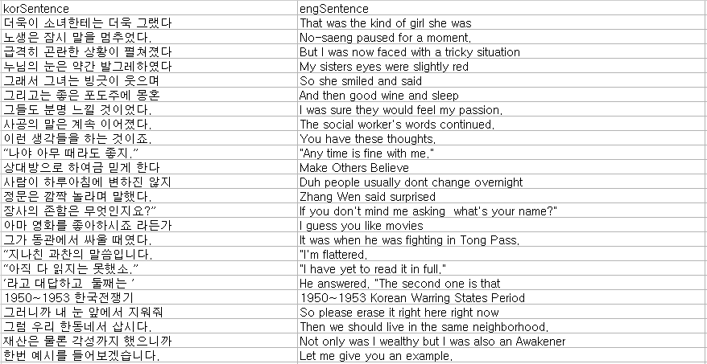

자연어 처리 관련 용어
말뭉치(corpus(코퍼스)): 자연어 처리에서 모델을 학습시키기 위한
데이터

행을 읽는 방법
열을 읽는 방법
통계, 인공지능, 수학

토큰(token): 자연어 처리를 위한 문서는 작은 단위로 나누어야 하는데, 이때 문서를 나누는 단위
토큰 생성(tokenizing): 문자열을 토큰으로 나누는 작업
토큰 생성 함수: 문자열을 토큰으로 분리하는 함수
토큰화(tokenization): 텍스트를 문장이나 단어로 분리하는 것. 토큰화 단계를 마치면 텍스트가 단어 단위로 분리
불용어(stop words): 문장 내에서 많이 등장하는 단어
분석과 관계없으며, 자주 등장하는 빈도 때문에 성능에 영향을 미치므로 사전에 제거해 주어야 함
불용어 예로 “a”, “the”, “she”, “he” 등이 있음
조사, 형용사, 부사 등 다 제거
