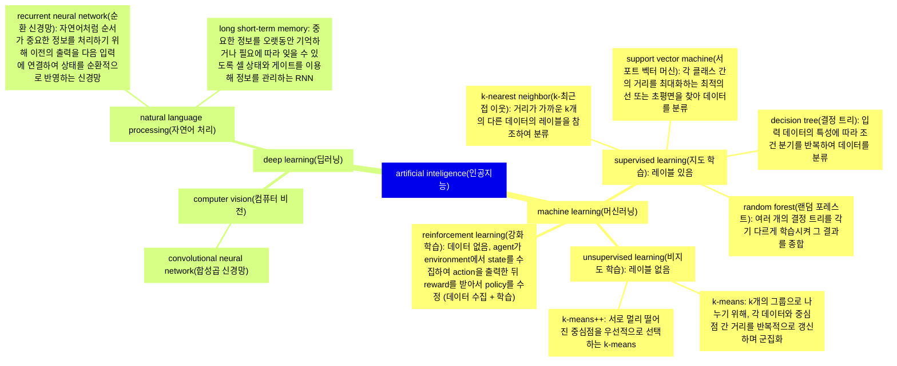
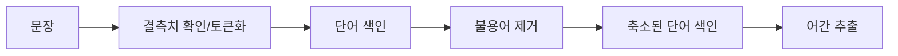

## 인공지능 개론

artificial inteligence
machine learning
supervised learning 문제 정답
knn 최근접 이웃, svm 서포트 벡터 머신, d.t 의사결정트리(서포트벡터머신이 더 잘함), r.f 랜덤포레스트(앙상블이 더 잘함)
unsupervised learning 문제
k-means, k-means++
reinforcement learning envirment agent state reward action
deep learning
cnn: convolution neural network
nlp:

## 자연어 처리
1. 말뭉치(corpus): 자연어 처리에서 모델을 학습시키기 위한 데이터 세트
2. 토큰(token): 자연어 문서를 분석 가능하도록 나누는 단위
3. 토큰 생성(tokenizing) 또는 토큰화(tokenization):  텍스트를 토큰 단위로 분리하는 과정
5. 품사 태깅(part-of-speech tagging): 단어에 품사 정보를 매핑하는 작업이며, 이 결과를 활용해 특정 품사의 단어를 불용어로 처리할 수 있음
6. 불용어(stop words): 문장 내에서 등장하는 빈도 때문에 성능에 영향을 미치므로 사전에 제거해 주어야 함 불용어 예로 "a", "the", "she", "he" 등이 있음 조사, 형용사, 부사 등 다 제거
7. 어간 추출(stemming): 단어를 기본 형태로 만드는 작업

   <table>
     <tr align="center">
       <td>태그</td>
       <td>Det</td>
       <td>Noun</td>
       <td>Verb</td>
       <td>Prep</td>
       <td>Det</td>
       <td>Noun</td>
     </tr>
     <tr align="center">
       <td></td>
       <td colspan="6">품사 태깅</td>
     </tr>
     <tr align="center">
       <td>입력 텍스트</td>
       <td>A</td>
       <td>cat</td>
       <td>is</td>
       <td>on</td>
       <td>the</td>
       <td>sofa</td>
     </tr>
   </table>
8. 10장 5개
9. 9장 15개
10. 자연어 처리 과정
   <table>
     <tr>
        <th>자연어</th>
        <th>전처리</th>
        <th>임베딩</th>
        <th>모델/모형 적용</th>
    </tr>
    <tr>
        <td rowspan="4">입력 텍스트</th>
        <td>1. 토큰화</th>
        <td rowspan="4">단어 -> 벡터 변환</th>
        <td rowspan="2">결정 트리</th>
    </tr>
    <tr>
        <td>2. 불용어 제거</td>
    </tr>
    <tr>
        <td>3. 어간 추출</td>
        <td rowspan="2">서포트 벡터 머신</th>
    </tr>
    <tr>
        <td>4. 정규화</td>
    </tr>
  </table>
9. 9-6 각 설명
10. KoNLPy: 한국어 처리를 위한 파이썬 라이브러리
11. 형태소
    <table>
       <tr align="center">
          <th>문장</th>
          <td colspan="4">딥러닝 책이 출판되었습니다.</td>
       </tr>
       <tr align="center">
          <th>어절</th>
          <td>딥러닝</td>
          <td>책이</td>
          <td>출판</td>
          <td>되었습니다.</td>
       </tr>
       <tr align="center">
          <th>형태소</th>
          <td>되</td>
          <td>었</td>
          <td>습니다</td>
          <td>.</td>
       </tr>
    </table>
12. Gensim: 파이썬의 워드투벡터(Word2Vec) 라이브러리
13. 코드는 빈공간 메꾸기
14. 전처리 과정

16. 데이터 불러오기: `df = pd.read_csv()`
18. 결측치 개수 확인: `df.isnull().sum()`
19. 결측치 비율 확인: `df.isnull().sum() / len(df)` 
15. 결측치 처리 방법
    - 데이터가 많은 경우: 인스턴스 삭제
    - 데이터가 적은 경우: 인스턴스 유지
20. 결측치를 포함한 인스턴스 삭제: `df.dropna()`
21. 결측치를 0으로 채우기: `df.fillna(0, inplace=True)`
22. 결측치를 평균값으로 채우기: `df[x].fillna(df[x].mean(), inplace=True)`
23. 결측치를 최빈값으로 채우기 또는 (위 + 아래) / 2
24. 토큰화 뜻 예제 'A', 'cat', 'is' ...
25. 아포스트로피 설명 x
26. utf-8 미출제
27. 정규화(normalization): 모든 데이터가 동일한 정도의 범위를 갖도록 하는 것
28. 정규화 방법: 
    1. `standardScaler.fit_transform(train_data)`: 특성의 평균을 0, 분산을 1로 변경
    2. `minMaxScaler.fit_transform(train_data)`: 0과 1 사이의 값으로 변경
31. 사분위x
32. wordcloud: 단어의 빈도수를 시각적으로 표현한 그래픽
33. tf-idf: 문서 집합 내에서 특정 단어가 한 문서에는 얼마나 자주 등장하고 전체 문서에는 얼마나 드물게 등장하는지를 곱해, 특정 문서에서 단어의 중요도를 수치로 나타내는 방법
